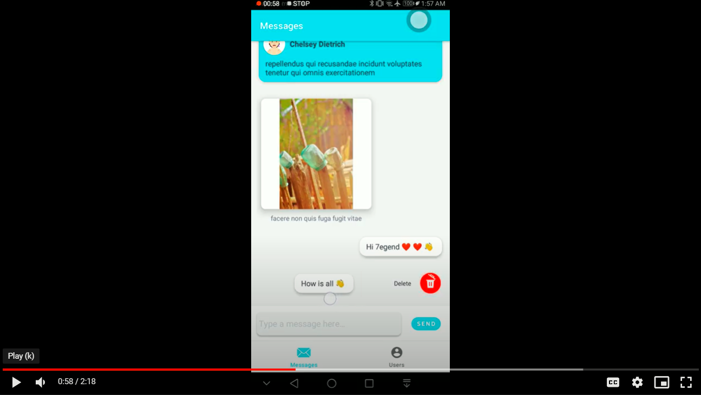

# LegendTechTask by Anwar Bani Amer
android Kotlin chat app shows a conversation (messages with attachments + users)

- kotlin
- MVVM architecture
- coroutines
- dependency Injection
- Retrofit for API 
- Room for offline App
- Room database relations ships(one-one) (one-many)
- Paging 3 for pagination
- view and data binding
- design patterns
- unit-testing, Junit 4
- Lottie for animation

Features:
- users are able to view a conversation between a set of users
- user can send a message
- users can delete a message
- users can Undo deleting a message
- users can show a list of conversation users with their last message
- offline app
- internet connection status

<table>
  <tr>
    <td></td>
    <td></td>
  </tr>
  <tr>
    <td></td>
    <td></td>
  </tr>
  <tr>
    <td></td>
    <td></td>
  </tr>
 </table>
